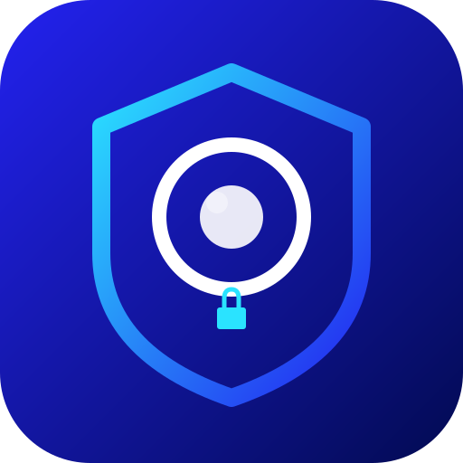

  

<h1 align="center">SafeShot</h1>

  <strong>Privacy-first screenshot tool for Windows</strong> 
  Your screenshots stay yours. No cloud. No tracking. No compromises.

  

---

## What is SafeShot?

SafeShot is a lightweight screenshot tool that lives in your system tray. Capture any area of your screen, annotate it, and save or copy instantly. Everything stays on your computer, nothing is ever uploaded anywhere.

## Download and Install

1. Go to the [latest release](https://github.com/mchiappinam/SafeShot/releases/latest)
2. Download the `.exe` installer
3. Run the installer and follow the prompts
4. SafeShot will appear in your system tray (near the clock)

SafeShot starts automatically when your computer boots. You can toggle this from the tray menu.

## How to Use

### Capture a Screenshot
- Press **Print Screen** on your keyboard, or
- Click the **SafeShot icon** in your system tray

### Select an Area
- Click and drag to select the area you want to capture
- Drag the edges or corners to resize
- Drag inside the selection to move it
- Press **Ctrl+A** to select the entire screen

### Annotation Tools
Once you've selected an area, a toolbar appears with drawing tools:

| Tool | Description |
|------|-------------|
| 🖊 Sharpie | Freehand drawing |
| 🖍️ Highlighter | Semi-transparent marker |
| ╱ Line | Straight line |
| ➜ Arrow | Line with arrowhead |
| ▢ Rectangle | Rectangle shape |
| ○ Circle | Ellipse shape |
| △ Triangle | Triangle shape |
| ⬡ Octagon | Regular octagon |
| T Text | Click to type text |
| ◻/◼ Solid | Toggle filled or hollow shapes |
| 🎨 Color | Pick a color |
| ⚪ Thickness | Adjust stroke width |

### Save and Copy
- **Ctrl+C** copies the screenshot to your clipboard
- **Ctrl+S** opens a Save As dialog
- **Ctrl+Z** / **Ctrl+Y** for undo and redo
- **ESC** to cancel and close

### Tray Menu
Right-click the SafeShot icon in your system tray for:
- Capture Screenshot
- Open Save Folder
- Start on Boot (toggle)
- About
- Quit

## Features

- Instant screen capture with area selection
- 10 annotation tools with color picker and thickness control
- Solid or hollow shapes
- Multi-monitor support
- Keyboard shortcuts for everything
- Auto-start on boot
- Saves to your Pictures/SafeShot folder
- Remembers your last color and thickness
- Tiny installer (~8 MB)
- Zero network access, fully offline

## Privacy

SafeShot has **zero network capabilities**. It cannot connect to the internet. Your screenshots are never uploaded, shared, or tracked. Everything stays on your local machine.

## System Requirements

- Windows 10 or later
- ~20 MB disk space

## License

MIT, see [LICENSE](LICENSE)

## Author

Developed by [Matheus Chiappina](https://chiappina.com)
